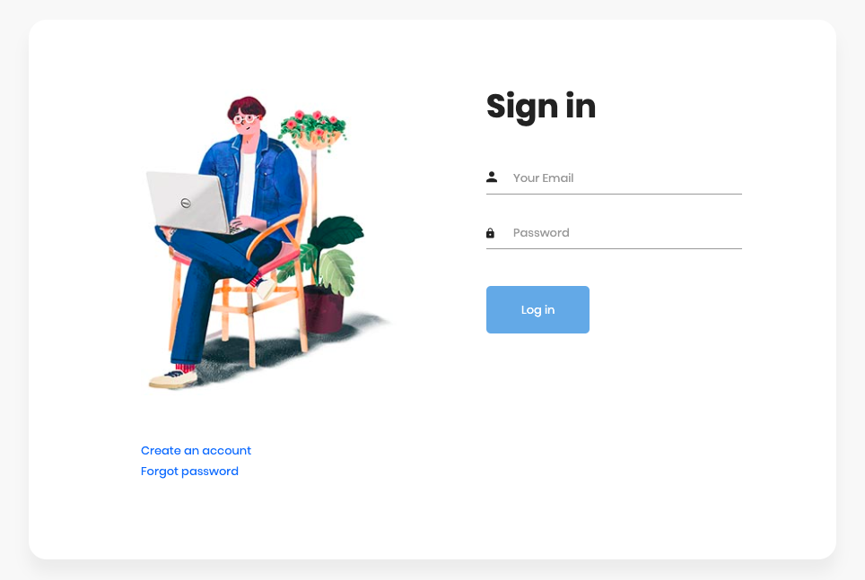
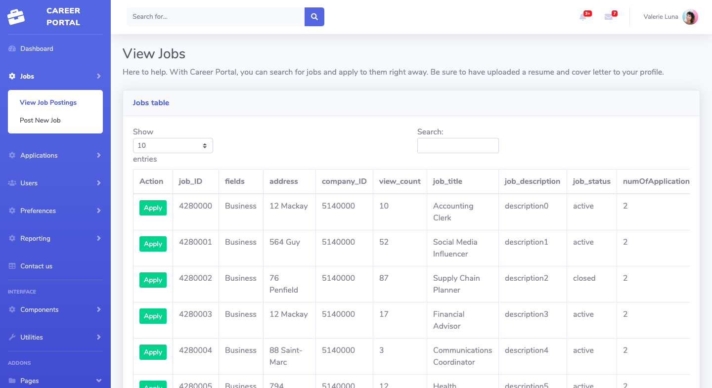

# Career Portal

Access the GUI [here](https://career-portal-353.herokuapp.com)

<p align="center">

</p>
<p align="center">

</p>

## Accounts for testing:
**Please make sure the username and the password do not contain any whitespace when logging in**
#### As employer:
+ Angela Lopez (gold membership)
    - username: `alopez@outlook.com`
    - password: `alopezpsw`

+ Lisa Gagnon (prime membership)
    - username: `lgagnon@outlook.com`
    - password: `lgagnonpsw`

#### As job seeker:
+ Jennifer Carleton (gold membership)
    - username: `jcarleton@yahoo.com`
    - password: `jcarletonpsw`

+ Kelly Lee (prime membership)
    - username: `klee@outlook.com`
    - password: `kleepsw`

## Note:
The application is hosted on Heroku with free dyno. Thus, there might be a delay when starting the website the first time.
> If an app has a free web dyno, and that dyno receives no web traffic in a 30-minute period, it will sleep. In addition to the web dyno sleeping, the worker dyno (if present) will also sleep.
 [from Heroku Dev Center](https://devcenter.heroku.com/articles/free-dyno-hours#:~:text=If%20an%20app%20has%20a,minute%20period%2C%20it%20will%20sleep.&text=Free%20web%20dynos%20do%20not,has%20free%20dyno%20hours%20available)

## About:
Career Portal is a web application that allows employer and job seeker connect with each other and apply for jobs


## Info:
+ Built with: Python, Flask
+ Styled with: Bootstrap 
+ Containerized with: Docker
+ Hosted on: Heroku
+ MySQL database: Concordia ENCS server

## How it works?
+ The web application was built mainly with Python and Flask. When the program starts, it establishes a SSH tunnel to Concordia University ENCS server, then it binds the remote SSH port of MySQL to a local port that can be accessed by Python.
+ Flask then serves dynamic webpages to user and make queries to the mySQL database using `pymysql`

## Project structure:
+ `app.py`: Main python file to start the web app
+ `auth.py`: Python file used to create new account or verify users
+ `dbfunctions.py`: contains all the methods that will access the database and run queries
+ `requirements.txt`: A list of dependencies in the project
+ `example_config.py`: an example config file to config database credentials:
+ `docs`: LaTeX files to write the report
    - `main.tex`: The main latex file
    - `\figure`: a folder contains the EOD file of the group and the ERD diagram
    - `SQL`: all the SQL code that is used to create and populate table
+ `\templates`: HTML files will be served by Flask at runtime
+ `\static`: contains the styling of the site:
    - `vendor`: Bootstrap 4.0 core
    - `css`
    - `img`
    - `js`
    - `scss`
+ `Dockerfile` for build instruction with Docker

## Build Guide:
###  Create virtual environment:
`python3 -m venv env # On macOS and Linux`
or
`py -m venv env # On windows`

### Activate virtual environment:
`source env/bin/activate # On macOS and Linux`
or
`.\env\Scripts\activate # On windows`

### Install dependencies:
```
pip install --upgrade pip
pip install -r requirements.txt
```
### Config Database:
+ Create `config.py` in home directory based on the file `example_config.py` with your own credentials:
```
SSH_USERNAME="SSH_USERNAME"
SSH_PASSWORD="SSH_PASSWORD"
DB_PASSWORD="DB_PASSWORD"
DB_USER="DB_USER"
DB_DATABASE="DB_DATABASE"
```

### Start program:
`python3 app.py` 

## Deploy to Heroku (using Heroku CLI):
+ `heroku container:login` to log in to Heroku account
+ `heroku container:push web --app career-portal-353`: Push to remote
+ `heroku container:release web --app career-portal-353`: Release the web app. 

## Dependencies:
Consult the file [requirements.txt](./requirements.txt) for a full list of used dependencies